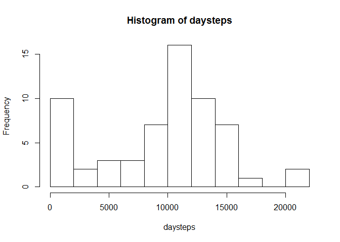
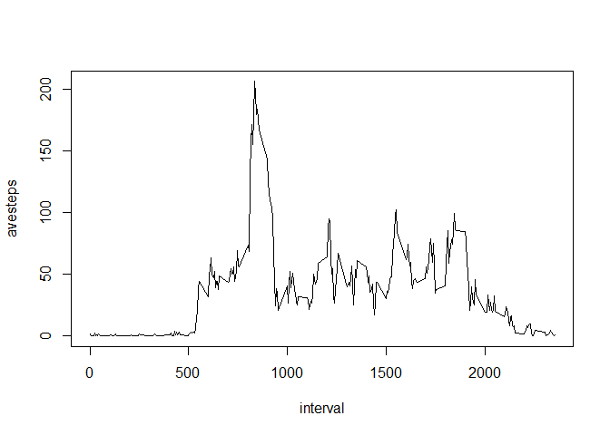
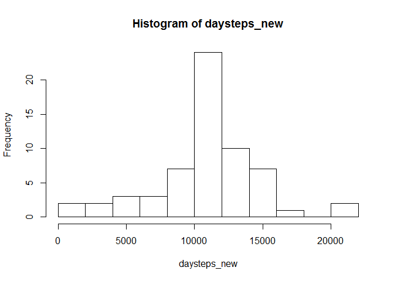
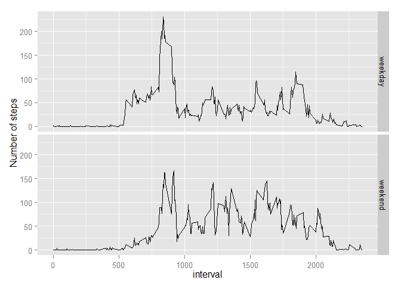

# PA1_template.Rmd
#This report shows the analysis of the activity monitor data with steps, date and interval.

load librarys

```r
library(ggplot2)
library(reshape2)
```
##Part1
Load the data and change date to Date format:

```r
unzip("activity.zip")
data <- read.csv("activity.csv")
data$date <- as.Date(data$date)
```
Calculate the total number of steps taken per day and plot histogram:

```r
daysteps <- with(data,tapply(steps,date,sum,na.rm=T))
hist(daysteps,10)
```

 

The mean and median of the total number of steps taken per day are:

```r
mean(daysteps)
```

```
## [1] 9354.23
```

```r
median(daysteps)
```

```
## [1] 10395
```
## Part 2
Average all 5-min interval steps over the days and plot:

```r
avesteps <- with(data,tapply(steps,interval,mean,na.rm=T))
plot(unique(data$interval),avesteps,type="l",xlab="interval")
```

 
The maximum number of steps happen at the 5-min interval:

```r
names(which(avesteps==max(avesteps)))
```

```
## [1] "835"
```
## Part 3
Calculate total number of NA:

```r
sum(is.na(data$steps))
```

```
## [1] 2304
```
Filling the missing values with the mean of that 5-min interval to make a new data frame called "ss":

```r
ss <- data
logical <- is.na(ss$steps)
ss$steps[logical]<-avesteps[as.character(ss$interval[logical])]
```
Plot the histogram of the new data set:

```r
daysteps_new <- with(ss,tapply(steps,date,sum,na.rm=T))
hist(daysteps_new,10)
```

 
The mean and median of the new data set is:

```r
mean(daysteps_new)
```

```
## [1] 10766.19
```

```r
median(daysteps_new)
```

```
## [1] 10766.19
```
Both values are slightly larger than the initial estimate with missing values. Also the mean is equal to the median after imputing missing data, while they differ before.The peak close to zero step is gone.

#Part 4
Create new factor variable "status" with two levels-"weekday" and "Weekend":

```r
days <- weekdays(ss$date)
ss$status <- "weekday"
ss$status[days %in% c("Saturday","Sunday")] <- "weekend"
ss$status <- as.factor(ss$status)
```
Plot steps of 5-min intervel averaged across all weekdays and weekends:

```r
aveweekday <- with(ss[ss$status=="weekday",],tapply(steps,interval,mean))
aveweekend <- with(ss[ss$status=="weekend",],tapply(steps,interval,mean))
df <- data.frame(interval=unique(ss$interval),weekday=aveweekday,weekend=aveweekend)
meltdata <- melt(df,id.vars="interval",measure.vars=c("weekday","weekend"))
names(meltdata) <- c("interval","day","ave.steps")
g <- ggplot(meltdata)
g + geom_line(aes(x=interval,y=ave.steps,type="l")) + facet_grid(day~.) + ylab("Number of steps")
```

 
